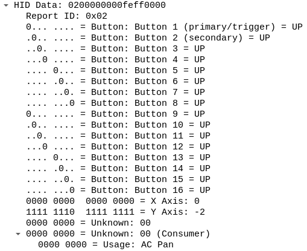
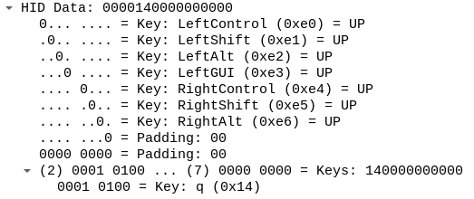
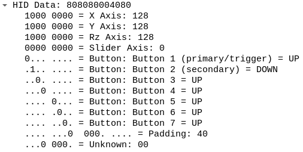
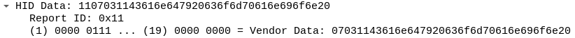

.. meta::
    :title: GSoC 2020 - Wireshark USB HID Report Descriptor Parser
    :date: 2020-08-23T17:59:11+01:00
    :summary: Final project write-up for my GSoC 2020 project, "Wireshark USB
              HID Report Descriptor Parser", where I implemented a USB HID
              report descriptor parser for Wireshark. The project resulted in
              Wireshark gaining the ability to decod data from USB HID devices,
              such as mice and keyboards.

Introduction
============

Today I am writing about my project for `Google Summer of Code`_ 2020,
improving the Wireshark USB HID dissector. This summer, with the help of
`Tomasz Moń`_, I am taking upon the task of writing a HID report descriptor
parser and adding annotations for HID data in Wireshark_.

Moving forward with this project, I have some personal goals. I would really
like to have Wireshark dissect the HID vendor pages |--| vendor data. That
will make it easier for people without much HID knowledge to reverse engineer
vendor protocols and contribute to projects such as libratbag_. My other goal
was designing the report descriptor parser in such a way it would be easy to add
new dissections for HID data.

Preparation
===========

Before starting working on the HID report descriptor parser, I did a bit of
refactoring to the HID dissector and changed the HID report descriptor
annotations to have the data look as shown in the specification_. I also added
some missing HID usage pages.

This allowed me to get to know a bit more about the Wireshark internals, as well
as how the HID dissector was implemented. I think this step was incredibly
helpful.

The work
========

Before I started working on the HID report descriptor parser, I spent a few days
with the HID specification. This allowed me to familiarize myself more with the
intricacies of the of HID and the report descriptor format. It helped a lot
designing the data structures and the parser. Even with this preparation, I did
not get it right at first, but I got it close enough that it was easy to fix.

After having the parser implemented, I started working on the data annotations.
Along the way, I naturally tweaked the parser to better adapt to our use case.
The step of writing the annotations also presented its issues.
Wireshark operates data at a byte level, but HID operates at a bit level. There
were already some internal ways to try to get around this issue, but they needed
to be expanded to properly cater to the needs of HID. Wireshark has encontered
some protocols needed to dynamically annotate data on a bit level, but their
requirements were simpler, they mostly wanted to annotate a fixed data type.
HID, however, can have long data fields, so our main question here was how to
annotate byte arrays that are bit limited? The same approach used in other types
of data couldn't be applied here.

Overcoming these issues, I think we got some nice end results.

    Image 1 - Mouse data dissection

    Image 2 - Keyboard data dissection

    Image 3 - Joystick data dissection

    Image 4 - Vendor data dissection

As you can see, annotations for some fields are still missing. I will keep
adding more fields as time allows. What is important here is that I accomplished
my goal related to the report descriptor parser design, adding support for more
fields is easy and I hope this will enable other people to contribute.

During this, I found an issue where the USB bus ID and device address might not
initialized, it was `fixed by Tomasz`_.

Gotchas
=======

Missing descriptors
-------------------

To dissect the HID data we need access to the report descriptor, which tells us
how the reports are structured. This is also the case of for eg. the USB
configuration descriptors, we need to look at the configuration descriptors to
understand the endpoints. But there is an issue, we are dissecting from a
capture, either live or from a file, we may not have access to the device to
fetch this descriptors. Because of this, we need the packets that ask the device
for this information to be included in the capture.
Fortunately, if you have a recent enough libpcap_ version, it asks the device
for the USB configuration descriptors when you start recording, but
unfortunately, it doesn't do the same for the HID report descriptors.

So, if you want to look at HID data dissections, you need to start recording
before plugging in the device, this way you will also capture the packets where
the operating system asks the device for the HID descriptors.

USB dissector bug
-----------------

While working on this project, I found some cases where the data wasn't being
properly dissected by the HID dissector. Tomasz had a look at them and it turns
out there is a bug in the USB dissector that causes this data to be dissected
twice. The bug hasn't been fixed yet, so if your data isn't being dissected,
even though you have the HID report descriptor available, this is probably the
cause.

Multiple usage pages per item
-----------------------------

This is allowed by the HID specification but is not common in the wild. I opted
to work on more relevant things.

Conclusion
==========

Overall, I think the project went fine, but not perfectly. There were some
issues along the way, but in the end I did achieve the goals that were set. I
think both me and Tomasz were hoping for me to be able to do a bit more than
this, maybe add dissections for a custom/vendor protocol on top of this new
annotations, but unfortunately that wasn't possible.

I would like to give a huge thanks to Tomasz, he helped me out figuring the
Wireshark internals and got me out of some rabbit holes when trying to
interpret the HID specification. I would also like to thanks Benjamin Tissoires,
who really helped me get started with the HID protocol and build up the base
knowledge essential to me being able to complete this project. Finally, I want
to thank the rest of the Wireshark developers who helped me out in the IRC and
reviewed my patches, as well as Google_ for making this experience possible.

Code
====

Here are the more significant patches.

- General dissector refactoring: 1e60efeb641c83a9436b0a5e258af56ee4ef413d_
- HID report parser annotations refactoring: f8de1fcddb1ef452a3f5429bff69cd1976d20e07_

- Save the HID report descriptors: c3e2f3cf9c556cc849b50cdba7b2a9af05effe54_
- Annotate HID data: f1bc8ad34b55cba7234536483d42c551fc3b2f17_
- Add HID report descriptor parser: 2d49ab3d25435be3d15c9a59189f4017db5c5ddb_
- Save input and output usages separately: bef04c21b4664f4318705ec3ccb48919407f0484_

- Dissect vendor data: b9588c213c6b70cc1e0045917c3f0aeb02c10408_
- Minimal dissection of unknown (unimplemented) usages: a5ed52b66680b12af1bb50f015972d3554619240_
- Dissect axis and vectors from th generic desktop usages page: 2429dae6797f8e533558d06ff36c4a789ddf1c4f_
- Dissect the button usage page: 8a389fef8f8ee50ecddfe3b6cba3345fe20dca52_
- Dissect padding: 73a3afcacefee0ada95fb1dee5fe7c42fafb975b_
- Dissect keyboard usage page: 101275395f97aaa1d9a3bd225fdf85c39baa4716_

Some of the patches haven't been merged yet, they are waiting on other patches
that touch the Wireshark internals and are still under review. You can check my
worktree here_ (link_ with a pinned commit).

.. |--| unicode:: U+2013 .. en dash

.. _Google Summer of Code: https://summerofcode.withgoogle.com
.. _Tomasz Moń: https://github.com/desowin
.. _Wireshark: https://www.wireshark.org
.. _libratbag: https://github.com/libratbag/libratbag
.. _specification: https://www.usb.org/hid
.. _fixed by Tomasz: https://code.wireshark.org/review/#/c/37328
.. _libpcap: https://github.com/the-tcpdump-group/libpcap
.. _Google: https://www.google.com
.. _here: https://github.com/FFY00/wireshark/commits/hid
.. _link: https://github.com/FFY00/wireshark/commits/101275395f97aaa1d9a3bd225fdf85c39baa4716

.. _1e60efeb641c83a9436b0a5e258af56ee4ef413d: https://github.com/wireshark/wireshark/commit/1e60efeb641c83a9436b0a5e258af56ee4ef413d
.. _f8de1fcddb1ef452a3f5429bff69cd1976d20e07: https://github.com/wireshark/wireshark/commit/f8de1fcddb1ef452a3f5429bff69cd1976d20e07
.. _c3e2f3cf9c556cc849b50cdba7b2a9af05effe54: https://github.com/wireshark/wireshark/commit/c3e2f3cf9c556cc849b50cdba7b2a9af05effe54
.. _f1bc8ad34b55cba7234536483d42c551fc3b2f17: https://github.com/wireshark/wireshark/commit/f1bc8ad34b55cba7234536483d42c551fc3b2f17
.. _2d49ab3d25435be3d15c9a59189f4017db5c5ddb: https://github.com/wireshark/wireshark/commit/2d49ab3d25435be3d15c9a59189f4017db5c5ddb
.. _bef04c21b4664f4318705ec3ccb48919407f0484: https://github.com/wireshark/wireshark/commit/bef04c21b4664f4318705ec3ccb48919407f0484
.. _b9588c213c6b70cc1e0045917c3f0aeb02c10408: https://github.com/FFY00/wireshark/commit/b9588c213c6b70cc1e0045917c3f0aeb02c10408
.. _a5ed52b66680b12af1bb50f015972d3554619240: https://github.com/FFY00/wireshark/commit/a5ed52b66680b12af1bb50f015972d3554619240
.. _2429dae6797f8e533558d06ff36c4a789ddf1c4f: https://github.com/FFY00/wireshark/commit/2429dae6797f8e533558d06ff36c4a789ddf1c4f
.. _8a389fef8f8ee50ecddfe3b6cba3345fe20dca52: https://github.com/FFY00/wireshark/commit/8a389fef8f8ee50ecddfe3b6cba3345fe20dca52
.. _73a3afcacefee0ada95fb1dee5fe7c42fafb975b: https://github.com/FFY00/wireshark/commit/73a3afcacefee0ada95fb1dee5fe7c42fafb975b
.. _101275395f97aaa1d9a3bd225fdf85c39baa4716: https://github.com/FFY00/wireshark/commit/101275395f97aaa1d9a3bd225fdf85c39baa4716
